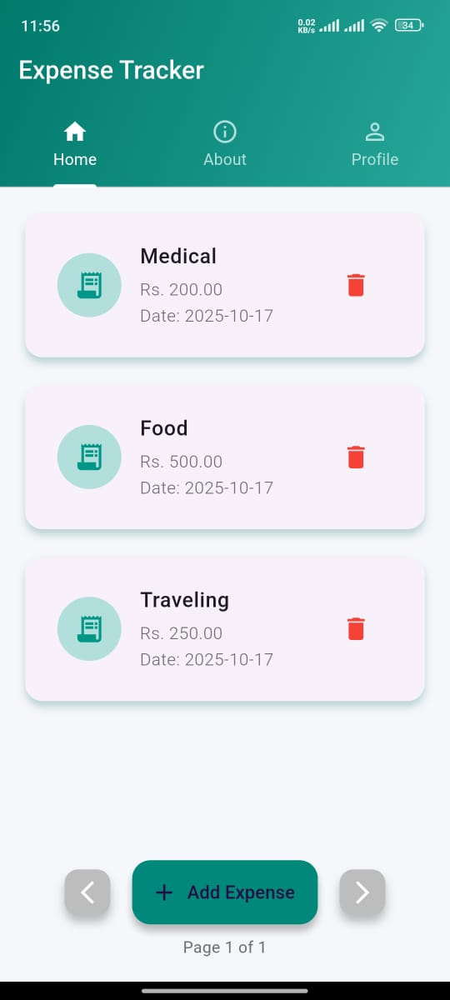
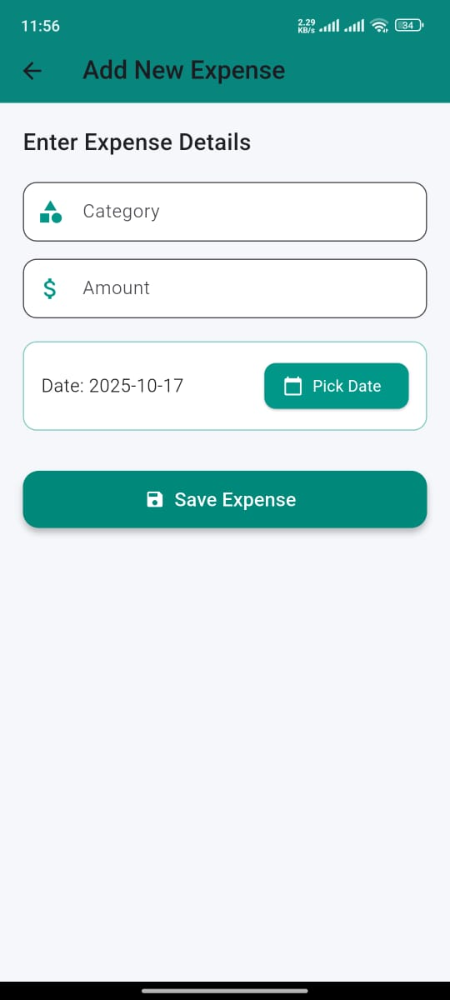
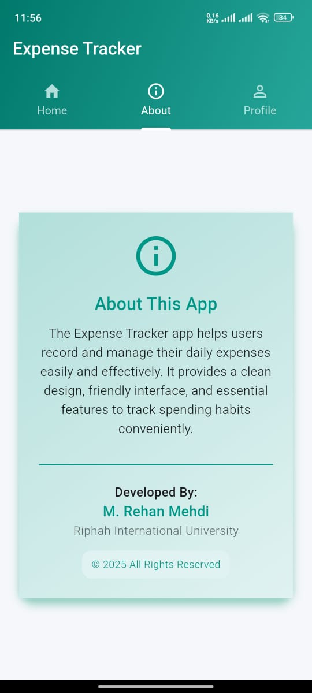
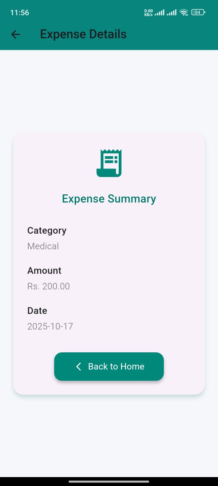

# 💰 Expense Tracker App

A simple, elegant, and user-friendly **Expense Tracker** built with **Flutter**.  
This app helps users record, manage, and view their daily expenses effectively with a clean interface and smooth navigation.

---

## 🧾 Features

- ➕ Add new expenses easily  
- 🗑️ Delete expenses instantly  
- 📅 View expenses with date and category  
- 📊 Paginated expense list (4 expenses per page)  
- 🔁 Next and Previous navigation buttons  
- 🧍 Profile and About tabs included  
- 💚 Beautiful modern UI using Flutter’s Material Design  
- 📱 Responsive layout that works on different screen sizes  

---

## 🧠 Tech Stack

- **Language:** Dart  
- **Framework:** Flutter  
- **IDE Used:** Android Studio / Visual Studio Code  
- **Architecture:** Stateful Widgets + Clean UI  

---

## 📸 App Screenshots

### 🏠 Home Screen

### ➕ Add Expense Screen

### ℹ️ About Tab

### 📄 Expense Detail Screen

---

## 👨‍💻 Developer

**Developed By:**  
🧑‍💻 **M. Rehan Mehdi**  
🎓 *Riphah International University*  
🧑‍🏫 *Supervised by: Sir Waqar*  
📅 **© 2025 All Rights Reserved**

---

## 🌟 Future Enhancements

🔹 Add expense categories and charts  
🔹 Implement Firebase for cloud storage  
🔹 Add authentication (login/signup)  
🔹 Export expenses to PDF  

---

⭐ *Thank you for checking out this project! If you like it, don’t forget to star the repository.*
